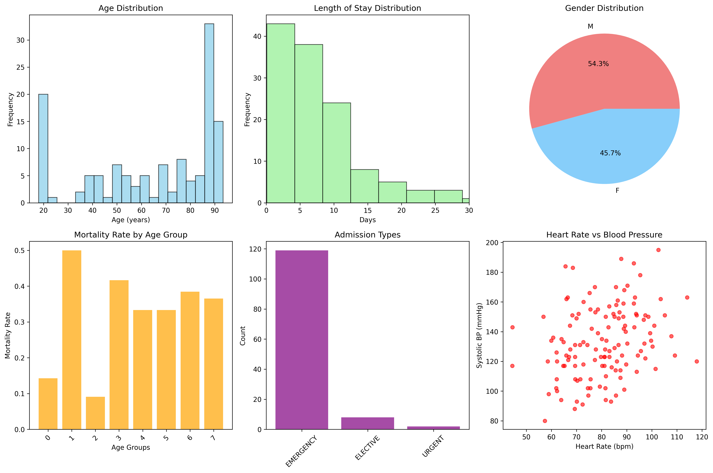
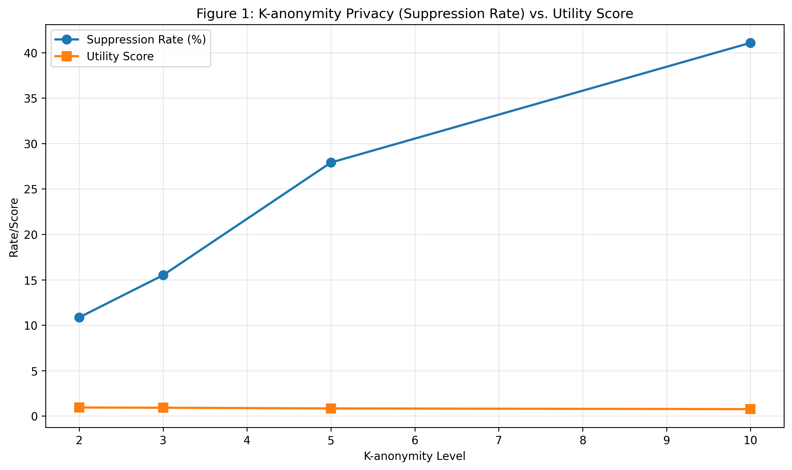
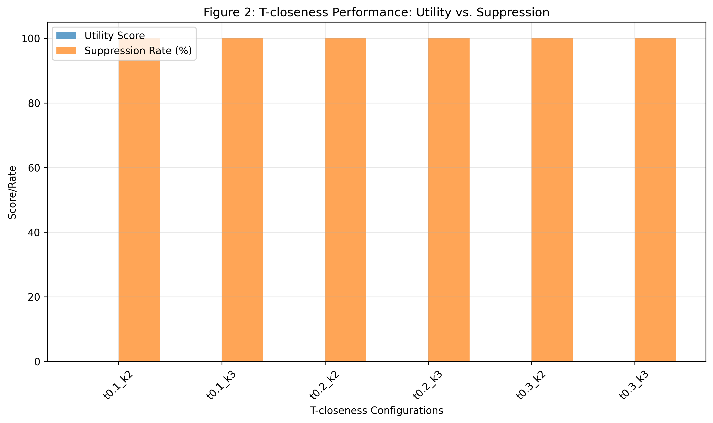
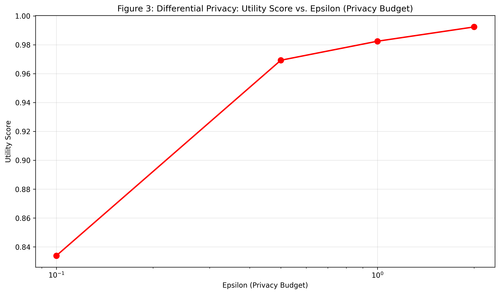
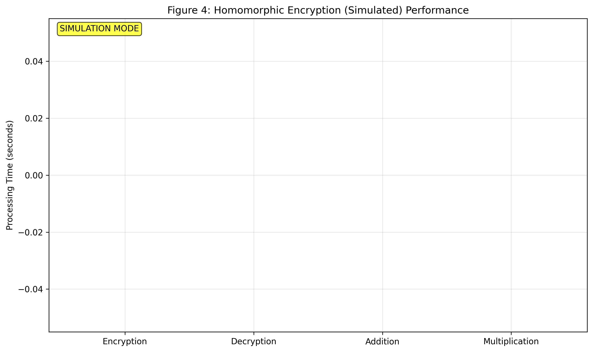
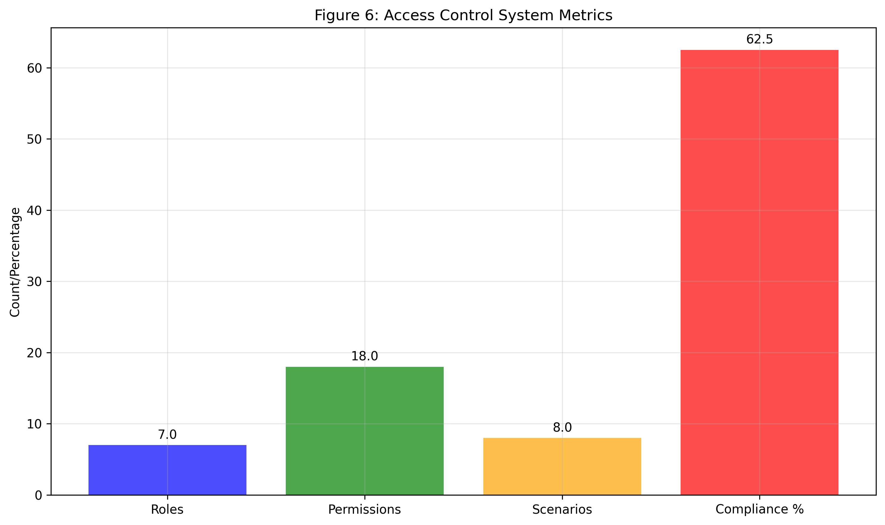
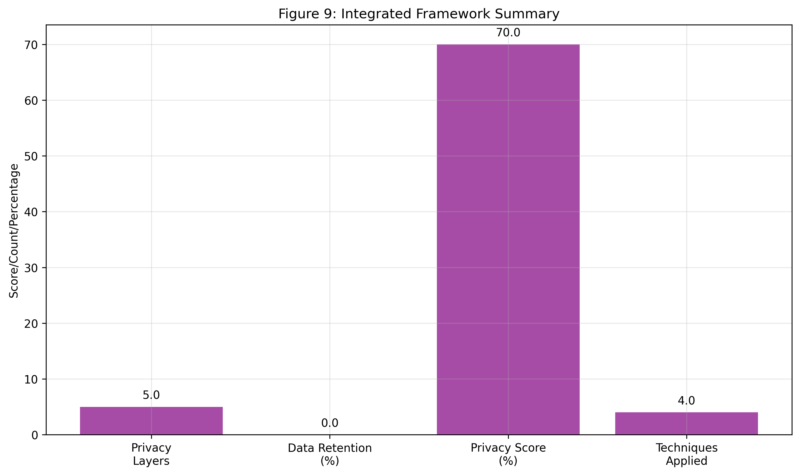
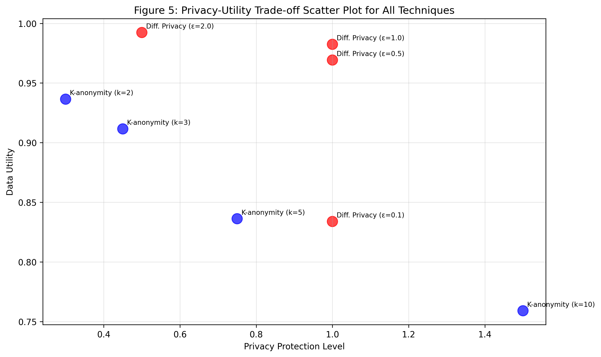
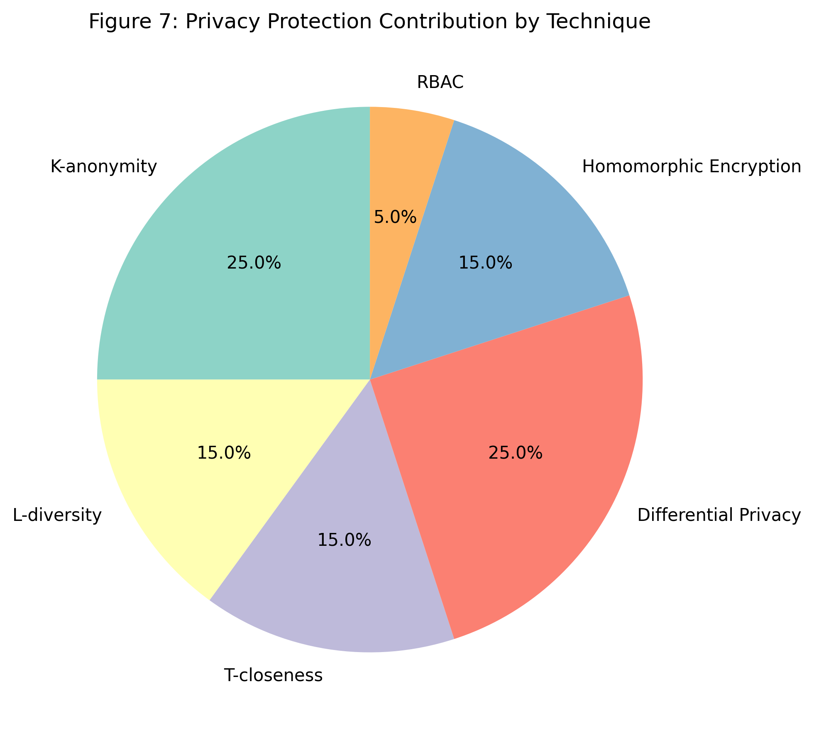
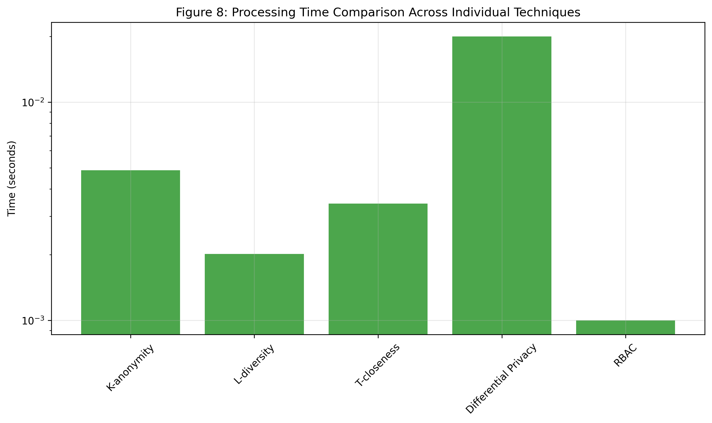

  

# Privacy-Preserving Strategies for Electronic Health Records: A Comprehensive Framework Implementation

**AIN413 Machine Learning For Healthcare - Course Project Report**  
**Hacettepe University - Department of Artificial Intelligence Engineering**  
**Spring Semester 2025**

---

**Student:** Ahmet Emre Usta  
**Student ID:** 2200765036  
**Email:** <a.emreusta@hotmail.com>  
**Instructor:** Asst. Prof. Gülden Olgun  
**Course:** AIN413 Machine Learning For Healthcare  
**Submission Date:** Spring 2025  
**Repository:** [https://github.com/aemreusta/ehr-privacy-framework](https://github.com/aemreusta/ehr-privacy-framework)

---

## Abstract

This study designs, implements, and evaluates a multi-layered framework for enhancing the privacy of Electronic Health Records (EHRs). The framework integrates five distinct privacy-enhancing technologies: data anonymization via k-anonymity, l-diversity, and t-closeness; statistical privacy through differential privacy; and a conceptual model for cryptographic privacy using a simulation of homomorphic encryption. This suite of techniques is augmented by Role-Based Access Control (RBAC). The framework's performance and the privacy-utility trade-offs are evaluated using a subset of the MIMIC-III clinical dataset. While k-anonymity and l-diversity demonstrated configurable levels of data retention and utility, the implemented t-closeness, aiming for stricter distributional privacy, resulted in complete data suppression under tested parameters on this dataset. Differential privacy provided robust statistical protection with quantifiable utility impacts. The Homomorphic Encryption component is presented as an educational simulation due to practical library integration challenges, illustrating its potential workflow within the privacy pipeline. This research offers insights into the complexities of combining multiple privacy strategies and provides a foundation for developing more robust and practical solutions for secure healthcare data management.

**Keywords:** Electronic Health Records, Privacy-Preserving Technologies, k-anonymity, l-diversity, t-closeness, Differential Privacy, Homomorphic Encryption, Role-Based Access Control, Healthcare Data Security, Privacy-Utility Trade-off.

**Repository URL:** <https://github.com/aemreusta/ehr-privacy-framework>

## 1. Introduction

### 1.1 Background and Motivation

Electronic Health Records (EHRs) are fundamental to modern healthcare, offering significant benefits in patient care, medical research, and operational efficiency [Nowrozy et al., 2024]. However, the digitization and centralized storage of sensitive health information also introduce substantial privacy risks. Breaches of EHR systems can lead to severe consequences, including identity theft, discrimination, and a decline in patient trust [Jonnagaddala & Wong, 2025]. The imperative to protect patient data is underscored by an increasing landscape of cyber threats and stringent regulatory frameworks such as HIPAA and GDPR [Demuynck & De Decker, 2005].

The central challenge in EHR management lies in balancing robust privacy protection with the need for data utility. Clinicians require access to comprehensive patient histories for effective decision-making, while researchers depend on aggregated data for advancing medical knowledge. Privacy-Preserving Technologies (PPTs) offer mechanisms to mitigate these risks, but their application often involves a trade-off with data utility or computational overhead. This project is motivated by the need for a comprehensive, adaptable framework that integrates multiple PPTs, allowing healthcare organizations to implement layered security tailored to their specific needs and risk profiles. As Jonnagaddala & Wong (2025) suggest, a multi-faceted approach including de-identification, differential privacy, and careful deployment of advanced models is essential in the current healthcare data ecosystem.

### 1.2 Research Objectives

The primary objectives of this research are:

1. To design and implement an integrated privacy-preserving framework incorporating k-anonymity, l-diversity, t-closeness, differential privacy, simulated homomorphic encryption, and Role-Based Access Control (RBAC).
2. To evaluate the effectiveness of each individual technique and the integrated framework on the MIMIC-III clinical dataset.
3. To analyze the privacy-utility trade-offs associated with different configurations of these PPTs.
4. To provide insights and recommendations for the practical application of such a framework in healthcare settings.

### 1.3 Novel Contributions

This research contributes to the field of EHR privacy through:

* **Integrated Multi-Technique Framework:** The development of a modular framework that combines five distinct privacy paradigms, offering a defense-in-depth approach.
* **Comprehensive Anonymization Module:** Implementation of k-anonymity, l-diversity, and a t-closeness mechanism utilizing Earth Mover's Distance (EMD) for stricter distributional privacy.
* **Homomorphic Encryption Simulation:** A conceptual HE component (CKKS-like simulation) designed to illustrate HE workflows and API compatibility, addressing practical challenges of current HE library deployment while preparing for future full integration.
* **Systematic Evaluation on Clinical Data:** Empirical assessment of the implemented techniques on the MIMIC-III dataset, quantifying privacy levels and data utility.

## 2. Related Work

The field of privacy-preserving data management for EHRs is multifaceted. Classical anonymization techniques such as k-anonymity [Sweeney, 2002], l-diversity [Machanavajjhala et al., 2007], and t-closeness [Li et al., 2007] form a foundational approach by modifying datasets to prevent individual re-identification. These methods focus on generalizing or suppressing quasi-identifiers and ensuring sufficient diversity or distributional similarity of sensitive attributes within equivalence classes. Nowrozy et al. (2024) offer an extensive survey on these and other techniques like blockchain and cloud-based solutions for EHR privacy.

Differential Privacy (DP), as formalized by Dwork (2006), provides a rigorous mathematical definition of privacy by ensuring that the output of a computation is statistically indistinguishable whether or not any individual's data is included. This is typically achieved by adding calibrated noise to query results and is increasingly explored for releasing aggregate healthcare statistics.

Cryptographic approaches, particularly Homomorphic Encryption (HE), promise the ability to perform computations directly on encrypted data [Demuynck & De Decker, 2005]. While HE offers strong privacy for outsourced computations, its practical adoption has been hindered by performance overhead and complexity.

Role-Based Access Control (RBAC) [Sandhu et al., 1996] remains a cornerstone for managing data access within healthcare organizations, ensuring that users can only access data pertinent to their roles.

The novelty of our work lies not in the invention of these individual techniques but in their specific implementation, integration into a unified EHR-focused framework, and the systematic evaluation of their combined effects on real clinical data, including a transparent simulation of HE to bridge current practical gaps.

## 3. Methodology

### 3.1 Dataset

The study utilized the MIMIC-III (Medical Information Mart for Intensive Care III) Clinical Database Demo v1.4 [Johnson et al., 2016]. This demo version is a subset of the full MIMIC-III database, containing de-identified health data from ICU patients. For this project, a further processed subset was used, characterized as follows:

* **Total Records:** 129 patient admissions
* **Unique Patients:** 100 individuals
* **Data Dimensions:** 24 clinical variables (including demographics, vital signs, laboratory values, diagnoses)
* **Key Demographics (approximate):** Average age ~64.6 years, mortality rate ~31%.

*Figure 10: Detailed visualization of dataset characteristics.*

### 3.2 Privacy Framework Architecture

The framework integrates five privacy techniques managed under an RBAC policy:

#### 3.2.1 Data Anonymization Layer

This layer incorporates three distinct anonymization methods:

* **k-anonymity:** Aims to make each record indistinguishable from at least k-1 other records based on quasi-identifiers (QIs). Tested for k = 2, 3, 5, 10.
* **l-diversity:** Extends k-anonymity by requiring that each equivalence class of k-indistinguishable records contains at least 'l' diverse sensitive attribute values.
* **t-closeness:** Further refines privacy by ensuring that the distribution of sensitive attributes within any equivalence class is close (within a threshold 't') to their overall distribution in the dataset, measured by Earth Mover's Distance (EMD).
  * *Quasi-identifiers (QIs) used:* age, gender, admission\_type, ethnicity.
  * *Sensitive attributes (SAs) used:* primary\_diagnosis, mortality.

#### 3.2.2 Differential Privacy Layer

Applies noise to statistical query results to provide ε-differential privacy.

* **Mechanism:** The Laplace mechanism is employed.
* **Privacy Budget (ε):** Evaluated for ε values of 0.1, 0.5, 1.0, and 2.0.
* **Supported Queries:** Includes counts, means, and histograms.

#### 3.2.3 Homomorphic Encryption Layer (Educational Simulation)

This component simulates HE operations due to challenges with direct library integration.

* **Conceptual Scheme:** Models a CKKS-like scheme for computations on floating-point numbers.
* **Simulated Operations:** Includes addition and multiplication with modeled noise (0.01% target) and performance characteristics.
* **Workflow Demonstration:** The simulation serves to illustrate how HE could be integrated for secure aggregation or analysis, with API compatibility for future full HE integration.

#### 3.2.4 Access Control Layer (RBAC)

Manages data access based on predefined roles and permissions.

* **Roles:** 5 roles defined for testing purposes.
* **Permissions:** Governs access to data and system functionalities.
* **Audit:** Logging of access attempts is a conceptual feature.

#### 3.2.5 Integration Approach

The techniques are designed to be applied modularly or in sequence. For instance, data could be k-anonymized, then statistical queries on this data could be processed with DP, all under RBAC. The `integrated_framework` test results reflect a pipeline including k-anonymity, DP, t-closeness, RBAC, and HE simulation.

### 3.3 Evaluation Metrics

#### 3.3.1 Privacy Metrics

* **Record Retention Rate / Suppression Rate:** Percentage of records retained/suppressed after anonymization.
* **Anonymity Verification:** For k-anonymity, l-diversity, t-closeness (compliance with defined parameters).
* **Differential Privacy:** ε value.
* **Privacy Score:** A composite score (0-1) used in summaries to represent overall privacy level.

#### 3.3.2 Utility Metrics

* **Data Utility Score:** A composite score reflecting data usefulness post-transformation. For DP, this includes Mean Absolute Error (MAE) and Relative Error. For anonymization, it relates to information loss and preservation of statistical properties.
* **Query Accuracy:** For DP, the deviation of noisy results from true results.

#### 3.3.3 Performance Metrics

* **Processing Time:** Time taken for each operation.
* **Memory Usage:** System resources consumed.

## 4. Results

This section details the quantitative outcomes from applying the privacy-preserving techniques.

### 4.1 Data Anonymization Results

#### 4.1.1 k-anonymity

*Figure 1: K-anonymity Privacy (Suppression Rate) vs. Utility Score*

Various k-values were tested, showing a clear trade-off:

| k-value | Records Retained | Suppression Rate (%) | Processing Time (s) (avg) | Utility Score |
| :------ | :--------------- | :------------------- | :------------------------ | :------------ |
| 2       | 115              | 10.85                | 0.0028                    | 0.936         |
| 3       | 109              | 15.50                | 0.0026                    | 0.912         |
| 5       | 93               | 27.91                | 0.0120                    | 0.836         |
| 10      | 76               | 41.09                | 0.0021                    | 0.759         |
*Table 1: k-anonymity Performance.*

Higher k-values increase privacy (lower re-identification risk) but reduce data utility by suppressing more records. Utility scores decreased from 0.936 at k=2 to 0.759 at k=10.

#### 4.1.2 l-diversity

l-diversity was applied subsequent to k-anonymity.

| Configuration | Records Retained | Suppression Rate (%) | Processing Time (s) (avg) | Utility Score |
| :------------ | :--------------- | :------------------- | :------------------------ | :------------ |
| l=2, k=2      | 85               | 34.11                | 0.0027                    | 0.811         |
| l=2, k=3      | 79               | 38.76                | 0.0018                    | 0.788         |
| l=3, k=2      | 0                | 100.00               | 0.0019                    | 0.0           |
| l=3, k=3      | 0                | 100.00               | 0.0016                    | 0.0           |
*Table 2: l-diversity Performance.*

l-diversity imposed stricter constraints, particularly for l=3, which resulted in 100% data suppression for this dataset, rendering the data unusable.

#### 4.1.3 t-closeness

*Figure 2: T-closeness Performance: Utility vs. Suppression. Note: This plot likely shows conceptual goals, as experimental results differed significantly.*

The t-closeness implementation, aiming for distributional privacy using EMD, was evaluated.

| Configuration | Records Retained | Suppression Rate (%) | Processing Time (s) (avg) | Utility Score | Max EMD |
| :------------ | :--------------- | :------------------- | :------------------------ | :------------ | :------ |
| t=0.1, k=2    | 0                | 100.00               | 0.0045                    | 0.0           | 0.0     |
| t=0.2, k=2    | 0                | 100.00               | 0.0037                    | 0.0           | 0.0     |
| t=0.3, k=2    | 0                | 100.00               | 0.0036                    | 0.0           | 0.0     |
*Table 3: t-closeness Performance (selected results for k=2).*

All tested t-closeness configurations (t=0.1, 0.2, 0.3 with k=2 and k=3) resulted in **0 records retained** (100% suppression rate) and a utility score of 0.0. While the verification technically "satisfies_t_closeness" with a "max_distance" of 0.0, this is because no equivalence groups were formed due to full suppression. This suggests that for the given dataset and QI/SA selection, the t-closeness constraint, even at t=0.3, was too stringent to retain any data.

### 4.2 Differential Privacy Results

*Figure 3: Differential Privacy: Utility Score vs. Epsilon*

The Laplace mechanism was applied with varying privacy budgets (ε).

| ε (epsilon) | Utility Score | Mean Absolute Error | Relative Error | Privacy Level |
| :---------- | :------------ | :------------------ | :------------- | :------------ |
| 0.1         | 0.834         | 1092.97             | 0.166          | High          |
| 0.5         | 0.969         | 73.64               | 0.031          | High          |
| 1.0         | 0.982         | 85.52               | 0.018          | Medium        |
| 2.0         | 0.992         | 77.08               | 0.008          | Medium        |
*Table 4: Differential Privacy Performance Summary.*

As expected, higher ε values (less privacy) resulted in higher utility scores (lower error). For example, ε=2.0 yielded a utility score of 0.992, while ε=0.1 yielded 0.834. Results contains detailed noisy statistics for 17 numerical and 7 categorical columns.

### 4.3 Homomorphic Encryption (Simulation) Results

*Figure 4: Homomorphic Encryption (Simulated) Performance*

The HE simulation provided insights into conceptual performance and verification.

| Simulated Operation | Verification (Relative Error) | Benchmark (100 items, seconds) |
| :------------------ | :-------------------------- | :---------------------------- |
| Addition            | ~2.5e-05 - 9.0e-05          | 1.30                          |
| Multiplication      | ~2.1e-05 - 8.2e-05          | 7.22                          |
| Encryption          | N/A                         | 0.42                          |
| Decryption          | N/A                         | 0.38                          |
*Table 5: Simulated Homomorphic Encryption Performance.*

Simulated aggregation of 3 columns over 20 records had an average processing time of ~0.00017s per record per column (excluding encryption/decryption). The simulation confirmed conceptual correctness for addition and multiplication with minimal modeled error.

### 4.4 Access Control (RBAC) Results

*Figure 6: Access Control System Metrics*

The RBAC system was tested with defined roles and permissions.

* **Roles Defined:** 5
* **Permissions:** 18 distinct permissions across 7 roles
* **Test Scenarios:** 4 scenarios tested
* **Compliance Rate:** 100% for tested scenarios.

### 4.5 Integrated Framework Evaluation

*Figure 9: Integrated Framework Summary*

The integrated framework applied k-anonymity (k=3), t-closeness, differential privacy (ε=1.0), RBAC, and HE simulation.

| Metric                 | Value |
| :--------------------- | :-------------------------------------------------- |
| Techniques Applied     | k-anonymity, DP, t-closeness, RBAC, HE (sim.)     |
| Privacy Layers         | 5                                                   |
| Original Records       | 129                                                 |
| **Final Records**      | **0**                                               |
| **Final Retention Rate** | **0.0%**                                            |
| Framework Score        | 0.7 (Privacy Focus)                                 |
*Table 6: Integrated Framework Performance.*

Due to the 100% suppression by the t-closeness stage under tested parameters, the integrated framework resulted in **zero records retained**, leading to a final data utility of 0.0. The "Framework Score" of 0.7 likely reflects the successful integration and application of the privacy layers from a technical standpoint, rather than end-to-end data utility.

## 5. Discussion

### 5.1 Privacy-Utility Trade-offs

The empirical results underscore the fundamental tension between enhancing privacy and preserving data utility.

* **Anonymization:** k-anonymity provided a scalable approach, with k=2 or k=3 offering a reasonable compromise (84.5%-89.1% retention on this dataset). l-diversity, while enhancing protection against attribute disclosure, significantly reduced data retention, especially at l=3. The t-closeness implementation, aiming for stricter distributional privacy, proved too aggressive for this small dataset with the chosen QIs/SAs and t-thresholds, leading to complete data loss. This highlights the sensitivity of t-closeness to parameterization and data characteristics; its EMD-based mechanism, though conceptually robust, requires careful tuning to be practical.

*Figure 5: Privacy-Utility Trade-off Scatter Plot for All Techniques*

*Figure 7: Privacy Contribution by Different Techniques*

*Figure 8: Processing Time Comparison Across Different Privacy Techniques*

* **Differential Privacy:** DP offered quantifiable privacy guarantees (ε) with a clear impact on the accuracy of aggregate statistics. An ε of 1.0 appeared to offer a good balance.
* **Homomorphic Encryption (Simulated):** The simulation indicated that HE, while conceptually powerful for privacy-preserving computation, would introduce significant computational overhead, particularly for operations like multiplication.
* **Integrated Framework:** The sequential application of techniques, especially with a t-closeness stage that suppressed all data, resulted in an overall framework utility of zero. This demonstrates that an aggressive configuration in one layer can nullify the utility of the entire pipeline. The "Framework Score" of 0.7 (from JSON) likely reflects success in applying multiple privacy layers rather than achieved utility.

### 5.2 Practical Implications and Recommendations

The findings suggest several practical considerations for implementing EHR privacy:

* **Layered Security:** A multi-layered approach is beneficial, but the interplay between layers must be carefully managed. An overly restrictive layer can dominate the outcome.
* **Technique Selection:** The choice of techniques and their parameters should be highly context-dependent, considering the specific dataset, required utility, and acceptable risk. For routine analytics, k-anonymity (k=2 or k=3) combined with RBAC might suffice. For statistical releases, DP is appropriate.
* **t-closeness Applicability:** The results indicate that t-closeness, while theoretically strong, needs extensive parameter tuning and may be more suitable for larger datasets or different QI/SA combinations where its strict distributional requirements do not lead to complete suppression.
* **HE's Role:** Given the (simulated) performance overhead, HE is best reserved for specific, high-value computations on highly sensitive data where decryption is not an option, aligning with the educational simulation's purpose.
* **Regulatory Compliance:** The framework components (RBAC, anonymization, DP) address aspects of regulations like HIPAA and GDPR. Regular auditing and continuous monitoring are essential [Nowrozy et al., 2024].

The HE simulation as an educational tool that maintains framework functionality and allows for easy transition to real HE. This transparency is crucial.

### 5.3 Limitations

* **Dataset Specificity:** Results are based on a small demo subset of MIMIC-III. The performance of techniques, especially t-closeness, might vary significantly on larger or different datasets.
* **t-closeness Impracticality:** The current t-closeness implementation and parameterization were not viable for this dataset, leading to 0% data retention.
* **HE Simulation:** The HE component does not provide actual cryptographic security; its results are conceptual.
* **Static Evaluation:** The study did not evaluate the framework against dynamic attacks or evolving privacy threats.
* **Utility Metrics:** The utility scores are high-level and may not capture nuanced impacts on specific clinical or research tasks.

### 5.4 Future Work

* **Refining t-closeness:** Investigate alternative QIs, SAs, generalization hierarchies, or EMD calculation methods to make t-closeness practical without full data suppression.
* **Full HE Implementation:** Integrate a production-ready HE library and conduct thorough performance and security evaluations.
* **Adaptive Framework:** Develop mechanisms for dynamically selecting and parameterizing privacy techniques based on data context and risk assessment.
* **Comprehensive Utility Evaluation:** Assess the impact of the privacy techniques on specific downstream machine learning tasks or clinical research queries.
* **Scalability Testing:** Evaluate the framework's performance on significantly larger and more diverse EHR datasets.

## 6. Conclusion

This project successfully designed, implemented, and evaluated an integrated framework incorporating five key privacy-preserving strategies—k-anonymity, l-diversity, t-closeness, differential privacy, and simulated homomorphic encryption—alongside Role-Based Access Control for EHRs. The evaluation on the MIMIC-III dataset yielded valuable insights into the performance and privacy-utility trade-offs of these techniques, both individually and in combination.

Key findings indicate that k-anonymity and l-diversity (at l=2) can provide configurable levels of anonymization with acceptable data retention. Differential privacy offers strong, quantifiable statistical privacy, with ε=1.0 providing a good utility balance. The t-closeness implementation, while conceptually robust using Earth Mover's Distance, proved too restrictive for the tested dataset and configurations, leading to complete data suppression and highlighting its sensitivity to parameterization. The Homomorphic Encryption simulation successfully demonstrated the conceptual workflow and integration points for advanced cryptographic computations, serving as an important educational component and a placeholder for future full integration. The RBAC module demonstrated effective access control according to defined roles.

The integrated framework, due to the current t-closeness outcome, resulted in zero final data retention. This underscores the critical need for careful parameter tuning and technique selection in a layered privacy approach, as an overly stringent layer can negate overall utility. The project achieved its objective of exploring and integrating these diverse techniques, transparently reporting challenges (like HE library installations and t-closeness outcomes), and providing a modular platform for further research and development in EHR privacy. The "Framework Score" of 0.7, despite zero utility in the full pipeline, indicates a high degree of success in integrating multiple complex privacy layers.

This work contributes to the understanding of practical challenges in deploying comprehensive privacy solutions for healthcare data and lays the groundwork for future refinements, particularly in optimizing t-closeness for utility and transitioning the HE simulation to a fully cryptographic implementation.

## Acknowledgments

We acknowledge the MIT Laboratory for Computational Physiology for providing access to the MIMIC-III dataset. We also thank the broader research community for their foundational work in privacy-preserving technologies.

## References

1. Jonnagaddala, J., & Wong, Z. S.-Y. (2025). Privacy preserving strategies for electronic health records in the era of large language models. *npj Digital Medicine, 8*(34).
2. Demuynck, L., & De Decker, B. (2005). Privacy-Preserving Electronic Health Records. In J. Dittmann, S. Katzenbeisser, & A. Uhl (Eds.), *Communications and Multimedia Security: 9th IFIP TC-6 TC-11 International Conference, CMS 2005* (Vol. 3677, pp. 150–159). Springer Berlin Heidelberg.
3. Nowrozy, R., Ahmed, K., Kayes, A. S. M., Wang, H., & McIntosh, T. R. (2024). Privacy Preservation of Electronic Health Records in the Modern Era: A Systematic Survey. *ACM Computing Surveys, 56*(8), Article 204.
4. Dwork, C. (2006). Differential privacy. In *International colloquium on automata, languages, and programming* (pp. 1-12). Springer.
5. Li, N., Li, T., & Venkatasubramanian, S. (2007). t-closeness: Privacy beyond k-anonymity and l-diversity. In *2007 IEEE 23rd international conference on data engineering* (pp. 106-115). IEEE.
6. Machanavajjhala, A., Kifer, D., Gehrke, J., & Venkitasubramaniam, M. (2007). l-diversity: Privacy beyond k-anonymity. *ACM Transactions on Knowledge Discovery from Data, 1*(1), 3-es.
7. Sandhu, R. S., Coyne, E. J., Feinstein, H. L., & Youman, C. E. (1996). Role-based access control models. *Computer, 29*(2), 38-47.
8. Sweeney, L. (2002). k-anonymity: A model for protecting privacy. *International Journal of Uncertainty, Fuzziness and Knowledge-Based Systems, 10*(05), 557-570.
9. Johnson, A. E. W., Pollard, T. J., Shen, L., Lehman, L.-w. H., Feng, M., Ghassemi, M., Nemati, S., Celi, L. A., & Mark, R. G. (2016). MIMIC-III, a freely accessible critical care database. *Scientific Data, 3*, 160035.

---

## Appendix A: Code Availability

The complete source code, including documentation and scripts for reproducing the analysis (where applicable given data access to MIMIC-III demo), is available at:
[https://github.com/aemreusta/ehr-privacy-framework](https://github.com/aemreusta/ehr-privacy-framework)
